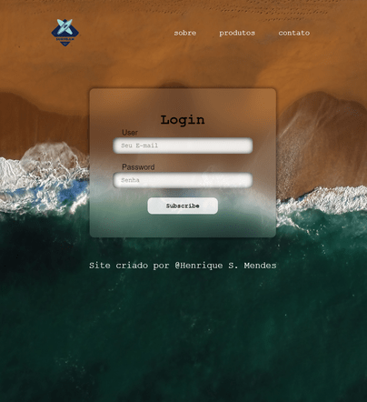

<h1 align='center'> 

SurfBan
</h1>

<button ><a href='https://henriquescloud.github.io/LOGIN-PAGE/index.html' > ACESSAR </a></button>

<h2 align='center'>🌊🏄 Apresentando a tela de login de tirar o ar do SurfBan! 🌊🏄</h2>  

🔥 Com a implementação cuidadosa de uma tela de login desenvolvida por mim, utilizando as tecnologias HTML5 e CSS3, você pode proporcionar aos usuários do seu projeto uma experiência de entrada com estilo e facilidade. A tela de login do SurfBan, criada com atenção aos detalhes, busca impressionar seus usuários ao oferecer um processo de autenticação ágil, intuitivo e seguro.

🎯 Com o objetivo de aprimorar a presença online e criar uma experiência visualmente profissional para o site oficial da Escola de Surf SurfBan, desenvolvemos um projeto personalizado que combina estética profissional e coerência com a marca.
 

💡🚀 O foco principal deste projeto foi garantir que o novo site fosse altamente interativo e oferecesse a máxima interação com os usuários móveis. Para atingir esse objetivo, desenvolvemos o site de forma responsiva, adaptando-se perfeitamente a qualquer dispositivo, seja um smartphone, tablet ou desktop.
 

    ✅ Segurança em destaque:
    Implementei recursos de autenticação robustos para garantir a privacidade e a proteção dos dados dos seus usuários. Com o SurfBan, a segurança é prioridade!

 

    ✅ Performance top de linha:
    Otimizei o código HTML5 e CSS3 para que a página de login do SurfBan carregue rapidamente, proporcionando uma experiência fluida e sem atrasos.

 

    ✅ Responsividade descolada:
    Meu design responsivo se adapta perfeitamente a qualquer dispositivo, desde smartphones até desktops. Seus usuários vão adorar a experiência perfeita em todas as telas!

 

    ✅ Experiência incrível do usuário:
    Com uma interface amigável, elementos visuais deslumbrantes e uma navegação intuitiva, a tela de login do SurfBan que desenvolvi garante uma experiência de login simples e visualmente cativante para seus usuários.

 

<h2>
    💻✍️ Tecnologias:
</h2>
 

